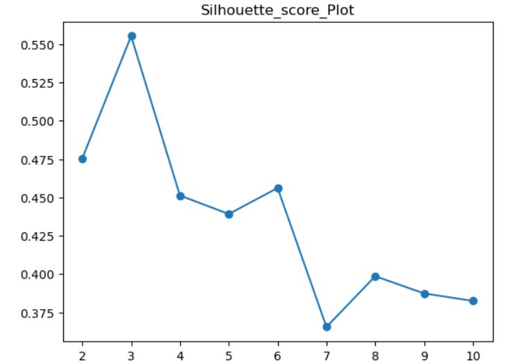
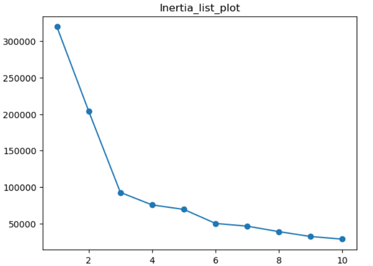
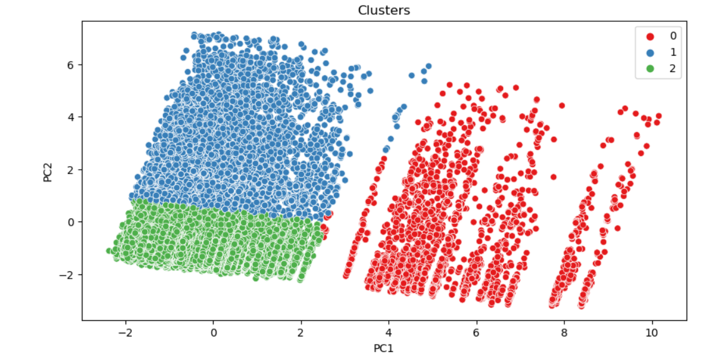

# -Market-Basket-Insights-Unlocking-E-Commerce-Customer-Behavior-
“Data-driven e-commerce analysis with RFM, K-Means clustering, predictive modeling, and market basket insights.”
# Market Basket Insights

## 📊 Business Objective
The goal of this project is to provide detailed insights for an e-commerce company to understand their sales, customers, and products better. The analysis helps in customer segmentation, predicting customer lifetime value (CLV), cross-selling, and forecasting customer behavior.

---

## 🛒 Data
The dataset used for analysis is named `loading.csv` and contains transaction-level details including:
- Customer ID
- Invoice ID
- Product details
- Quantity
- Average Price
- Discount
- GST
- Delivery Charges
- Marketing Spend
- Dates of transactions  

> Note: The raw dataset is **not included** to protect sensitive business data.

---

## 📈 Analysis Performed

### 1. Revenue Calculation
Invoice value (sale amount) for each transaction/item was calculated as:

---

### 2. Exploratory Data Analysis (EDA)
Performed detailed analysis on:
- **Customer Acquisition:** Number of new customers acquired every month.
- **Customer Retention:** Month-on-month retention analysis.
- **Revenue Analysis:** Revenue from new vs existing customers, discounts’ impact on revenue.
- **Sales Trends:** Revenue, number of orders, average order value, quantity, by category, month, week, day.
- **Location & Seasonality:** Sales trend analysis by product category, location, and month.
- **Operational Metrics:** Revenue vs Marketing Spend, Tax, Delivery Charges %.
- **Product Analysis:** Most purchased products by quantity and transactions.

---

### 3. Customer Segmentation
#### Heuristic Segmentation
- Segmented customers based on **RFM (Recency, Frequency, Monetary)**:
  - Premium
  - Gold
  - Silver
  - Standard  
- Defined business strategies for each segment.

#### Scientific Segmentation
- Performed **K-Means clustering** to find natural customer groups.
- Visualized segment profiles and patterns.

*Example Charts:*
  
 
  

---

### 4. Predicting Customer Lifetime Value (CLV)
- Dependent variable created using **customer revenue categories**:
  - Low Value
  - Medium Value
  - High Value
- Classification models were trained to predict CLV.

---

### 5. Market Basket / Cross-Selling Analysis
- Analyzed products that are frequently bought together.
- Performed **association rules analysis** to identify potential product bundles.

---

### 6. Predicting Next Purchase Day
- Calculated average days per transaction for **repeat customers**.
- Categorized next purchase window:
  - 0-30 days
  - 30-60 days
  - 60-90 days
  - 90+ days
- Built classification model to predict next purchase day for each customer.

---

### 7. Cohort Analysis
- Grouped customers by **cohort month** (first purchase month).
- Analyzed behavior and retention across cohorts.
- Identified **best performing cohort months** for retention.

---

## 🔧 Technologies Used
- Python (pandas, numpy, matplotlib, seaborn, scikit-learn)  
- Machine Learning (Classification, K-Means Clustering, RFM Analysis)  
- Data Visualization  

---

## 📂 How to Run
1. Clone this repository.  
2. Place your dataset files in the project folder. (for security purpose is not provided) 
3. This whole file is to show case the analysis and what are the cust of it 
4. Explore the charts and outputs.

---

## 📌 Notes
- The **raw data is not included** to protect sensitive information.  
- Charts/images are included in the `/images` folder for visualization reference.  
- This project can be used as a reference for **market basket insights, customer segmentation, and predictive analytics** in e-commerce.

---

